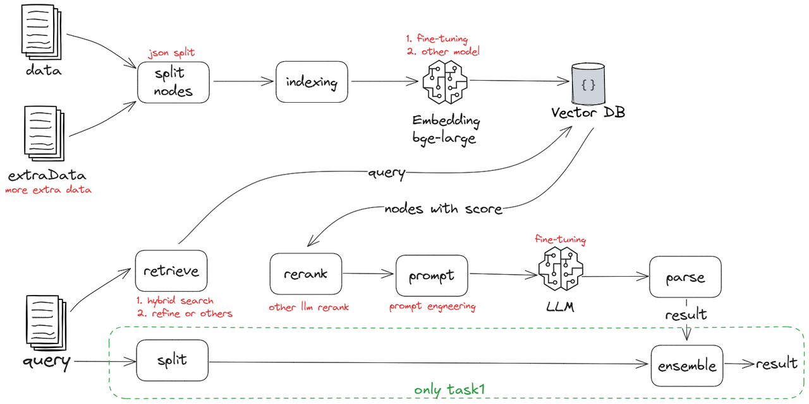

# CHIP2024-中医辨证思维测评任务
> 如下是我个人的解决方案（初赛第5，复赛第6），主要技术手段为RAG。
> 
>竞赛过程中尝试过7b模型的微调但效果不如RAG+通用大模型，初步分析原因有两点:
> 1. 数据量太小。传统中医似乎更加倾向于个人诊治经验（数据），而不是推理。而仅使用给出的两百条病例数据并不足以完成大模型微调，发挥其潜力。
> 2. 参数量不足。参数更大的模型内部知识记忆更丰富，但由于硬件设备限制，我并没有深入探究这方面。
     
> 方案具体实现方式详见代码。如果您对RAG技术有更深的学习需求，请参考我的RAG学习及实践项目[rag-best-practices
     Public](https://github.com/chaoql/rag-best-practices)。
>
> 本项目如果对您有所帮助，不妨给个star⭐，感谢~
## 1. 任务详情
本任务将拆分成4个子任务进行测试。在测评过程中，任务组织方将给定临床信息等相关材料，选手需要依序完成子任务1到子任务4的提问工作，此顺序为逻辑推理顺序，不可自行调整。在评分时，只按照任务编号依序考虑模型回答的结果。

## 2. 提交格式
提交文档格式为"xxxx.txt"格式

提交数据格式：

病例ID@;;** @*;*@*;*@临证体会：。辨证：

提交数据样例：

病例508@腰部酸痛;乏力;消瘦;脉弦小数;尺弱;舌质淡红;苔薄微黄@A;F@C@临证心得：此例患者体型瘦长，属木火之质，兼有腰痛与遗精滑泄之症。腰为肾脏所居之地，肾受纳五脏六腑之精华而藏之。若藏纳不固，则遗精滑泄频繁，此乃肾虚不能制约下焦，固摄功能失司所致。加之肾水亏虚，无以滋养肝木，肝主疏泄，疏泄过度，终致小便中肥膏之物漏失。辨证分析：此证当属肾阴亏虚，下焦虚损。
## 3. 测评指标

## 4. 解决思路
>病机是证候的基础：病机是疾病的本质，是证候形成的内在依据。病机的变化直接影响证候的表现。
>
>证候是病机的外在表现：证候是疾病在特定阶段的临床表现，是病机变化的外在反映，通过观察证候可以推断病机。
>
>病机与证候相互影响：病机的变化会导致证候的变化，反之，证候的变化也可以反映病机的变化，两者相互影响，相互转化。
>
>病机的复杂性决定了证候的多变性：由于病机的多元交叉、因果转化，证候也表现出多变性，即同一疾病在不同阶段可能表现出不同的证候，而不同的疾病在某一阶段可能表现出相似的证候。

综上，病机和证候之间或从某种程度上来说，是可以进行迭代优化并相互促进的，实验也证明了这一点。

单一任务的解决思路如下图所示：

